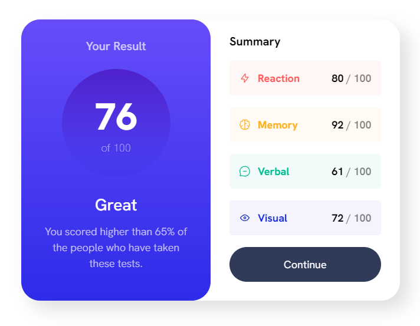

# Frontend Mentor - Results summary component solution

This is a solution to the [Results summary component challenge on Frontend Mentor](https://www.frontendmentor.io/challenges/results-summary-component-CE_K6s0maV). Frontend Mentor challenges help you improve your coding skills by building realistic projects.

## Table of contents

- [Overview](#overview)
  - [The challenge](#the-challenge)
  - [Screenshot](#screenshot)
  - [Links](#links)
- [My process](#my-process)
  - [Built with](#built-with)
  - [What I learned](#what-i-learned)
- [Author](#author)

## Overview

### The challenge

Users should be able to:

- View the optimal layout for the interface depending on their device's screen size
- See hover and focus states for all interactive elements on the page
- **Bonus**: Use the local JSON data to dynamically populate the content

### Screenshot

### Links

- Solution URL: [Add solution URL here](https://github.com/rreeves1996/fementor-results-summary-component)
- Live Site URL: [Add live site URL here](https://rreeves1996.github.io/fementor-results-summary-component/)

## My process

### Built with

- Semantic HTML5 markup
- CSS custom properties
- Flexbox
- Mobile-first workflow

### What I learned

I'm far too removed from the fundamentals of HTML and CSS! Although I had a solid grasp on HTML and CSS before moving to things like React, SCSS and Tailwind CSS, I should've either been returning occasionally back to reaffirm core principles into my brain.

Although I had no problems using semantic HTML as that's a habit I've been trying to reinforce since before I even touched React, I was surprised by how much trouble I had trying to recreate a layout from a JPEG accurately. I should continue to try and do these recreations in the future to continue to improve my skills mocking up sites/layouts from static images.

## Author

- Website - [rreeves.dev](https://rreeves.dev)
- LinkedIn - [Ryan Reeves](https://www.linkedin.com/in/rreevesdev)
- Frontend Mentor - [@yourusername](https://www.frontendmentor.io/profile/yourusername)
